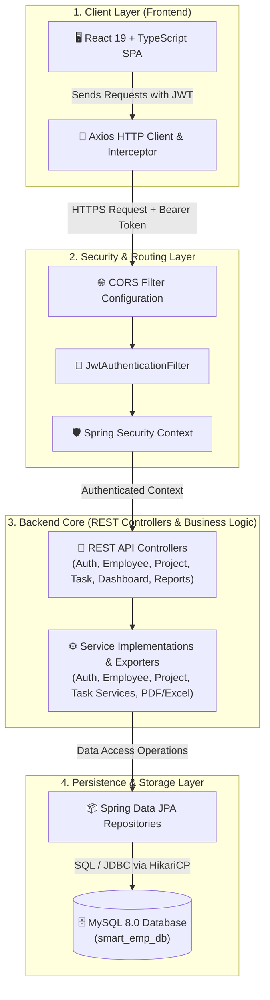
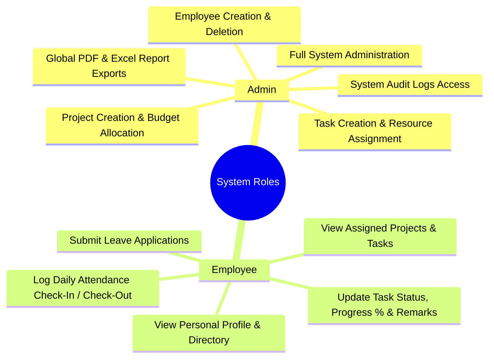

# Smart Employee & Project Management System

[](https://spring.io/projects/spring-boot)
[](https://react.dev/)
[](https://www.typescriptlang.org/)
[](https://www.mysql.com/)
[](#)

A full-stack enterprise web application for managing employees, projects, tasks, attendance, leave requests, and analytical reporting. Built with a **React 19 + TypeScript + Vite** frontend and a **Spring Boot 3 + MySQL 8.0** RESTful backend architecture.

---

## Table of Contents

1. [Project Title](#1-project-title)
2. [Project Description](#2-project-description)
3. [Features](#3-features)
4. [Technology Stack](#4-technology-stack)
5. [System Architecture](#5-system-architecture)
6. [Project Structure](#6-project-structure)
7. [Prerequisites](#7-prerequisites)
8. [Installation](#8-installation)
9. [Environment Variables](#9-environment-variables)
10. [Database Setup](#10-database-setup)
11. [Running the Application](#11-running-the-application)
12. [API Endpoints](#12-api-endpoints)
13. [User Roles](#13-user-roles)
14. [Screenshots](#14-screenshots)
15. [Postman Collection](#15-postman-collection)
16. [Database Script](#16-database-script)
17. [Future Enhancements](#17-future-enhancements)

---

## 1. Project Title

**Smart Employee & Project Management System**

---

## 2. Project Description

The **Smart Employee & Project Management System** is a unified corporate management solution designed to streamline HR administration, resource allocation, and project lifecycle tracking. The system bridges operational gaps between administrative leadership and workforce personnel by offering centralized controls for employee profiles, multi-member project tracking, sprint task assignments, biometric-style attendance tracking, leave processing, and automated document reporting.

### Purpose of the System
* **Centralized Workforce Operations**: Maintain structured employee records, including department assignments, designations, compensation details (in ₹ INR), certifications, and achievements.
* **Project & Task Transparency**: Track active project initiatives, budget allocations, team member assignments, task progression, and milestone deadlines.
* **Automated Analytics & Reporting**: Generate real-time executive dashboard statistics and downloadable reports (Excel & PDF formats).
* **Secure Access Control**: Enforce strict role-based access rules to protect corporate data and ensure appropriate system permissions.

### Target Users
* **Admin**: System administrators and HR executives who supervise system configuration, onboard/manage employees, assign project leads, approve leave requests, inspect system audit logs, and export system-wide reports.
* **Employee**: Corporate staff who view assigned projects, track task deadlines, update work progress %, log attendance, submit leave applications, and view personal performance history.

---

## 3. Features

### User Authentication (JWT)
* Stateless JSON Web Token (JWT) authentication using `jjwt` (0.12.5).
* Secure password hashing with Spring Security BCrypt.
* User Registration and Login endpoints returning bearer tokens.
* Protected session logout mechanism.
* Email-based Password Reset workflow (`/auth/forgot-password` and `/auth/reset-password`).

### Role-Based Access Control (Admin & Employee)
* Method-level security via Spring Security `@PreAuthorize` annotations (`hasRole('ADMIN')`, `hasRole('EMPLOYEE')`).
* 2 distinct user roles: **Admin** (full administrative authority) and **Employee** (restricted workforce operations).
* Frontend route protection (`ProtectedRoute.tsx`) ensuring unauthorized users cannot access restricted pages.
* Dynamic navigation menu items rendered based on the active user role.

### Employee Management
* Full CRUD (Create, Read, Update, Delete) operations for employee dossiers.
* Department tracking, designation mapping, address details, and employee code auto-indexing.
* Annual compensation tracking in ₹ INR.
* Status tracking (`ACTIVE`, `ON_LEAVE`, `TERMINATED`).
* Certifications and performance achievements tracking per employee.
* Upcoming employee birthdays notifier module.

### Project Management
* Project lifecycle creation, editing, and deletion.
* Priority classification (`LOW`, `MEDIUM`, `HIGH`, `URGENT`).
* Status tracking (`PLANNED`, `IN_PROGRESS`, `COMPLETED`).
* Budget allocation (in ₹ INR) and project timeline management (Start Date & Deadline).
* Multi-employee project assignments using an N:M junction schema (`project_employee_assignments`).
* Filtering of projects assigned to specific employees.

### Task Management
* Task assignment linked to specific projects and employees.
* Workflow status lifecycle (`TODO`, `IN_PROGRESS`, `REVIEW`, `DONE`).
* Progress tracking percentage bar (0% - 100%).
* Task deadline monitoring and priority indicators.
* Remarks and comments for feedback between team leads and assignees.

### Dashboard
* **Admin Dashboard**: System-wide high-level metrics including Total Employees, Total Active Projects, Total Tasks, and Department Counts.
* **Employee Dashboard**: Personalized summary showing individual assigned projects, pending tasks, recent team announcements, and attendance summary.

### Search Functionality
* Paginated and sorted multi-field searching for employees and projects.
* Real-time search by query string (name, email, code, designation, title).
* Multi-criteria filtering by Department, Employee Status, Project Status, and Project Priority.
* Dynamic sorting by field (e.g., `id`, `name`, `joining_date`, `deadline`) and direction (`asc`, `desc`).

### Profile Management
* Self-service profile page for viewing and editing current user information.
* Avatar picture management support.
* Contact information updates and security credential management.

### Reports/Analytics
* **Excel Export**: Export complete employee records into Microsoft Excel (`.xlsx`) using Apache POI.
* **PDF Export**: Export formatted employee reports into PDF documents using OpenPDF.
* **Analytics Metrics**: Departmental distribution metrics, project completion ratios, and task status breakdowns.

### Additional Implemented Features
* **Attendance Management**: Daily check-in and check-out time logging with work hours calculation.
* **Leave Requests Portal**: Employee leave application submission and manager approval/rejection workflows.
* **Audit Logging**: Comprehensive system audit log table (`audit_logs`) tracking administrative actions, user IDs, timestamps, and IP addresses.
* **Announcements Board**: Organization-wide notices broadcasted to employee feeds.
* **OpenAPI / Swagger Documentation**: Interactive API testing interface (`/swagger-ui.html`).
* **Code Explorer & Database Schema Inspector**: Embedded tools in the frontend UI for developer orientation.
* **Theme Support**: Dark mode and light mode interface switcher with persistent preference.

---

## 4. Technology Stack

### Frontend
| Component | Technology | Version |
| :--- | :--- | :--- |
| **Framework** | React | `19.0.1` |
| **Language** | TypeScript | `5.8.2` |
| **Build Tool** | Vite | `6.2.3` |
| **Routing** | React Router DOM | `7.18.1` |
| **HTTP Client** | Axios | `1.18.1` |
| **Icons** | Lucide React / React Icons | `0.546.0` / `5.7.0` |
| **Animations** | Motion (Framer Motion) | `12.23.24` |
| **Charts** | Recharts | `3.10.0` |
| **Utilities** | JSZip & FileSaver | `3.10.1` / `2.0.5` |

### Backend
| Component | Technology | Version |
| :--- | :--- | :--- |
| **Framework** | Spring Boot | `3.3.0` |
| **Language** | Java (JDK) | `21` |
| **Security** | Spring Security | `3.3.0` |
| **Persistence** | Spring Data JPA (Hibernate) | `3.3.0` |
| **Validation** | Spring Boot Starter Validation | `3.3.0` |
| **Email Service** | Spring Boot Starter Mail | `3.3.0` |
| **Excel Export** | Apache POI (`poi-ooxml`) | `5.2.5` |
| **PDF Export** | OpenPDF (`librepdf`) | `1.3.38` |
| **API Docs** | Springdoc OpenAPI Starter UI | `2.5.0` |
| **Utilities** | Lombok & MapStruct | `1.18.x` / `1.5.5` |

### Database
| Component | Technology | Version |
| :--- | :--- | :--- |
| **Engine** | MySQL Server | `8.0` |
| **Character Set** | `utf8mb4` | `utf8mb4_unicode_ci` |
| **Connection Pool** | HikariCP | Default Spring Boot |

### Authentication
* **Token Type**: JSON Web Token (JWT)
* **Library**: `jjwt-api`, `jjwt-impl`, `jjwt-jackson` (`0.12.5`)
* **Encryption**: HMAC SHA-256 for JWT signatures, BCrypt for password hashing

### API
* **Architecture**: RESTful Web Services
* **Format**: JSON (`application/json`), Binary Streams (`application/pdf`, `application/vnd.openxmlformats-officedocument.spreadsheetml.sheet`)
* **Documentation Spec**: OpenAPI 3.0 (Swagger UI at `/api/swagger-ui.html`)

### Styling
* **Framework**: Tailwind CSS v4 (`@tailwindcss/vite` `4.1.14`)
* **Design System**: Modern Glassmorphism CSS design system with custom light/dark theme variables.

### Other Libraries/Frameworks
* **Containerization**: Docker & Docker Compose (`docker-compose.yml`)
* **Build System**: Apache Maven 3.8+

---

## 5. System Architecture

The application follows a standard enterprise multi-tier architecture, separating presentation, business logic, data persistence, and database storage.



### Flow Breakdown
1. **Client Interaction**: The user interacts with the React single-page application built using Vite. Requests sent via Axios automatically attach a JWT bearer token to the `Authorization` header (`Bearer <token>`).
2. **Security Interception**: Spring Security intercepts incoming HTTP requests. The `JwtAuthenticationFilter` validates token integrity, extracts claims, loads user details via `CustomUserDetailsService`, and establishes security context in `SecurityContextHolder`.
3. **Controller Handling**: Spring MVC RestControllers receive requests, validate request bodies with `@Valid`, and invoke the corresponding service layer interface.
4. **Business & Export Execution**: Services perform business rules, calculations, object mapping (via MapStruct/Mappers), and repository invocations. Export requests process entity collections using `Apache POI` or `OpenPDF` to output raw byte arrays.
5. **Persistence**: JPA entities communicate with the MySQL database using Spring Data Repositories through HikariCP connection pooling.

---

## 6. Project Structure

```text
smart-employee-&-project-management-system/
├── backend/
│   ├── src/
│   │   └── main/
│   │       ├── java/com/smart/management/
│   │       │   ├── config/              # Security, CORS, and Swagger Configuration
│   │       │   ├── controller/          # REST Controllers (Auth, Employee, Project, Task, etc.)
│   │       │   ├── dto/                 # Data Transfer Objects & API Payloads
│   │       │   ├── entity/              # JPA Database Entities
│   │       │   ├── exception/           # Exception Handlers & Custom Exceptions
│   │       │   ├── mapper/              # Entity-DTO Mappers
│   │       │   ├── repository/          # Spring Data JPA Repositories
│   │       │   ├── security/            # JWT Filters, Token Providers & User Details
│   │       │   ├── service/             # Business Logic Interfaces & Implementations
│   │       │   └── utils/               # Excel and PDF Export Helper Utilities
│   │       └── resources/
│   │           └── application.yml      # Spring Boot Configuration Properties
│   ├── docker-compose.yml               # Docker Compose setup for MySQL & Backend
│   └── pom.xml                          # Maven Dependencies & Build Configuration
├── database/
│   ├── full_setup.sql                   # Combined DDL Schema & DML Seed Script
│   ├── schema.sql                       # DDL Script (Table Structures & Foreign Keys)
│   └── seed_data.sql                    # DML Script (Initial Records & Default Users)
├── frontend/
│   ├── src/
│   │   ├── components/                  # UI Views, Sidebar, Navbar, and Layouts
│   │   ├── data/                        # Mock Data & Static Backend Code Resources
│   │   ├── pages/                       # Application Views (Dashboard, Employees, Projects, Tasks)
│   │   ├── services/                    # Axios API Client & Authentication Service
│   │   ├── types/                       # TypeScript Data Model Interfaces
│   │   ├── App.tsx                      # Main Application Component with Routing
│   │   ├── index.css                    # Tailwind CSS Directives & Global Styles
│   │   └── main.tsx                     # React Application Entry Point
│   ├── index.html                       # HTML Template
│   ├── package.json                     # Frontend Dependencies & Vite Scripts
│   ├── tsconfig.json                    # TypeScript Configuration
│   └── vite.config.ts                   # Vite Development Server Proxy Setup
├── postman/
│   └── Smart_Employee_Management.postman_collection.json  # Postman API Collection
├── screenshots/                         # Manual Screenshots Directory
├── .env.example                         # Environment Variables Template
├── package.json                         # Monorepo Scripts Setup
└── README.md                            # System Documentation
```

---

## 7. Prerequisites

Before installing and running the application, ensure your environment meets the following requirements:

* **Java Development Kit (JDK)**: Java 21 or higher installed and added to `PATH`.
* **Node.js**: Node.js `v18.x` or `v20.x` (LTS recommended).
* **Package Manager**: `npm` (v9.x+) or `yarn` / `pnpm`.
* **Build Tool**: Apache Maven `3.8+` (or use the backend embedded maven plugin).
* **Database**: MySQL Server `8.0` running locally or on a server.
* **Version Control**: Git `2.x`.

---

## 8. Installation

### Step 1: Clone the Repository
```bash
git clone https://github.com/your-username/smart-employee-&-project-management-system.git
cd smart-employee-&-project-management-system
```

### Step 2: Configure Environment Variables
Create your local environment configuration files based on the provided `.env.example`:
```bash
cp .env.example .env
```

### Step 3: Database Import
Ensure MySQL is running, then create and seed the database using the provided SQL script:
```bash
mysql -u root -p < database/full_setup.sql
```

### Step 4: Install Backend Dependencies
Navigate to the `backend` directory and compile the Java application:
```bash
cd backend
mvn clean install
cd ..
```

### Step 5: Install Frontend Dependencies
Navigate to the `frontend` directory and install NPM packages:
```bash
cd frontend
npm install
cd ..
```

---

## 9. Environment Variables

Create a `.env` file in the project root or backend folder with appropriate values:

```env
# Application Settings
APP_PORT=8080
FRONTEND_PORT=3000

# Database Configuration
DB_HOST=localhost
DB_PORT=3306
DB_NAME=smart_emp_db
DB_USER=root
DB_PASSWORD=your_secure_password

# JWT Security Configuration
JWT_SECRET=404E635266556A586E3272357538782F413F4428472B4B6250645367566B5970
JWT_EXPIRATION_MS=86400000

# Mail Configuration (Optional - for Password Reset)
MAIL_HOST=smtp.gmail.com
MAIL_PORT=587
MAIL_USERNAME=your-email@gmail.com
MAIL_PASSWORD=your-app-password
```

---

## 10. Database Setup

### 1. Import Database Script
You can set up the database using MySQL CLI or MySQL Workbench:

#### Option A: Single Command Setup (Recommended)
Execute `full_setup.sql` to construct tables and populate seed data in one step:
```bash
mysql -u root -p < database/full_setup.sql
```

#### Option B: Step-by-Step Import
1. Create schema and tables:
   ```bash
   mysql -u root -p < database/schema.sql
   ```
2. Insert sample employees, projects, tasks, and default users:
   ```bash
   mysql -u root -p < database/seed_data.sql
   ```

### 2. Configure Spring Database Connection
The backend configuration is located in `backend/src/main/resources/application.yml`. Update credentials if necessary:

```yaml
spring:
  datasource:
    url: jdbc:mysql://${DB_HOST:localhost}:${DB_PORT:3306}/${DB_NAME:smart_emp_db}?useSSL=false&allowPublicKeyRetrieval=true&serverTimezone=UTC
    username: ${DB_USER:root}
    password: ${DB_PASSWORD:rootpassword}
    driver-class-name: com.mysql.cj.jdbc.Driver
  jpa:
    hibernate:
      ddl-auto: update
```

---

## 11. Running the Application

### Running the Backend

#### Using Maven (inside `backend/`):
```bash
cd backend
mvn spring-boot:run
```

#### Using Monorepo Command (from root):
```bash
npm run start:backend
```

* Backend API Base URL: `http://localhost:8080/api`
* Swagger UI Docs: `http://localhost:8080/api/swagger-ui.html`
* OpenAPI JSON Spec: `http://localhost:8080/api/v3/api-docs`

---

### Running the Frontend

#### Using Vite (inside `frontend/`):
```bash
cd frontend
npm run dev
```

#### Using Monorepo Command (from root):
```bash
npm run dev
```

* Frontend Web Application: `http://localhost:3000`

---

## 12. API Endpoints

### Authentication (`/auth`)
| Method | Endpoint | Description | Access |
| :--- | :--- | :--- | :--- |
| `POST` | `/auth/login` | Authenticate user credentials and return JWT bearer token | Public |
| `POST` | `/auth/register` | Register a new user and generate associated employee profile | Public |
| `POST` | `/auth/logout` | Invalidate current user session | Admin / Employee |
| `POST` | `/auth/forgot-password` | Send password reset token email to registered corporate email | Public |
| `POST` | `/auth/reset-password` | Update user password using validated reset token | Public |
| `GET` | `/auth/me` | Fetch profile details of currently authenticated user | Admin / Employee |

### Employee Management (`/api/employees`)
| Method | Endpoint | Description | Access |
| :--- | :--- | :--- | :--- |
| `POST` | `/api/employees` | Create a new employee record | Admin |
| `GET` | `/api/employees` | Fetch paginated employees with query searching, department filtering, and sorting | Admin / Employee |
| `GET` | `/api/employees/{id}` | Retrieve detailed employee record by ID | Admin / Employee |
| `PUT` | `/api/employees/{id}` | Update existing employee profile details | Admin |
| `DELETE` | `/api/employees/{id}` | Delete an employee record | Admin |
| `GET` | `/api/employees/departments` | Retrieve list of all distinct corporate departments | Admin / Employee |
| `GET` | `/api/employees/birthdays` | Retrieve list of upcoming employee birthdays | Admin / Employee |

### Project Management (`/api/projects`)
| Method | Endpoint | Description | Access |
| :--- | :--- | :--- | :--- |
| `POST` | `/api/projects` | Create a new project initiative | Admin |
| `GET` | `/api/projects` | Search and filter projects with pagination | Admin / Employee |
| `GET` | `/api/projects/{id}` | Retrieve project details by ID | Admin / Employee |
| `PUT` | `/api/projects/{id}` | Update project details, budget, or timelines | Admin |
| `DELETE` | `/api/projects/{id}` | Delete project from the system | Admin |
| `PUT` | `/api/projects/{id}/assign` | Assign team members/employees to a project | Admin |
| `GET` | `/api/projects/employee/{employeeId}` | Get list of projects assigned to a specific employee | Admin / Employee |

### Task Management (`/api/tasks`)
| Method | Endpoint | Description | Access |
| :--- | :--- | :--- | :--- |
| `POST` | `/api/tasks` | Create and assign a project task | Admin |
| `GET` | `/api/tasks` | Filter tasks by project ID, assigned employee ID, or status | Admin / Employee |
| `GET` | `/api/tasks/{id}` | Retrieve task details by ID | Admin / Employee |
| `PUT` | `/api/tasks/{id}` | Update task status (`TODO`, `IN_PROGRESS`, `REVIEW`, `DONE`), progress %, and remarks | Admin / Employee |
| `DELETE` | `/api/tasks/{id}` | Delete a task | Admin |
| `GET` | `/api/tasks/project/{projectId}` | Fetch all tasks belonging to a specific project | Admin / Employee |

### Dashboard & Analytics (`/api/dashboard` & `/api/reports`)
| Method | Endpoint | Description | Access |
| :--- | :--- | :--- | :--- |
| `GET` | `/api/dashboard/admin` | Fetch system-wide high-level metrics for admin dashboard | Admin |
| `GET` | `/api/reports/employees/excel` | Export complete employee directory to Excel (`.xlsx`) | Admin / Employee |
| `GET` | `/api/reports/employees/pdf` | Export formatted employee summary report to PDF (`.pdf`) | Admin / Employee |

---

## 13. User Roles

The system operates strictly on **2 User Roles**: **Admin** and **Employee**.



### Role Permissions Matrix

| System Permission / Action | Admin | Employee |
| :--- | :---: | :---: |
| View Directory & Assigned Projects / Tasks |  |  |
| Update Assigned Task Status, Progress % & Remarks |  |  |
| Mark Daily Attendance Check-In / Check-Out |  |  |
| Apply for Personal Leaves |  |  |
| View Personal Profile & Achievements |  |  |
| Create, Edit & Delete Employees |  | ❌ |
| Create, Edit & Delete Projects |  | ❌ |
| Assign Employees to Projects |  | ❌ |
| Create & Assign New Tasks |  | ❌ |
| Approve / Reject Leave Requests |  | ❌ |
| Access System Audit Logs (`audit_logs`) |  | ❌ |
| Access Admin Dashboard & Metrics |  | ❌ |
| Export Data to Excel (.xlsx) & PDF (.pdf) |  | ❌ |

---

## 14. Screenshots

Application interface screenshots are stored in the `/screenshots` directory. After capturing UI screenshots manually from your browser, save them in the folder using the corresponding names:

* `screenshots/01_login.png` - Login Page
* `screenshots/02_register.png` - Registration Page
* `screenshots/03_dashboard.png` - Executive Analytics Dashboard
* `screenshots/04_employee_management.png` - Employee Management Table & Dossier View
* `screenshots/05_project_management.png` - Project Tracking Cards & Assignee Drawer
* `screenshots/06_task_management.png` - Task Management & Kanban Board View
* `screenshots/07_search.png` - Multi-criteria Employee & Project Search Filter
* `screenshots/08_user_profile.png` - Personal Profile & Security Credentials Settings
* `screenshots/09_reports_analytics.png` - Analytics Charts & PDF/Excel Export Module
* `screenshots/10_admin_panel.png` - Audit Logs & Admin System Management
* `screenshots/11_mobile_responsive.png` - Responsive Mobile Screen Drawer & Layout View

> *Note: Place updated PNG images inside the `/screenshots` folder to maintain clear visuals for repository visitors.*

---

## 15. Postman Collection

A complete Postman collection JSON is embedded below and also available in the repository at `/postman/Smart_Employee_Management.postman_collection.json`.

### Location
* File Path: `postman/Smart_Employee_Management.postman_collection.json`

### How to Import and Use
1. Open **Postman**.
2. Click **Import** in the top-left corner.
3. Choose **File** and select `postman/Smart_Employee_Management.postman_collection.json` (or copy the JSON block below into a local file).
4. Set up an Environment in Postman with the following variables:
   * `baseUrl`: `http://localhost:8080`
   * `bearerToken`: *(Automatically populated upon running `/auth/login`)*
5. Execute the **Login** request first to obtain a JWT token, which will authorize subsequent requests via the `Bearer {{bearerToken}}` header.

### Complete Postman Collection JSON

```json
{
  "info": {
    "_postman_id": "8f2a4b1c-3d5e-4f6a-9b7c-1e2f3a4b5c6d",
    "name": "Smart Employee & Project Management System API",
    "description": "Postman Collection for Smart Employee & Project Management System REST API endpoints.",
    "schema": "https://schema.getpostman.com/json/collection/v2.1.0/collection.json"
  },
  "item": [
    {
      "name": "Authentication",
      "item": [
        {
          "name": "Login User",
          "event": [
            {
              "listen": "test",
              "script": {
                "exec": [
                  "var jsonData = pm.response.json();",
                  "if (jsonData.success && jsonData.data && jsonData.data.token) {",
                  "    pm.environment.set('bearerToken', jsonData.data.token);",
                  "    pm.collectionVariables.set('bearerToken', jsonData.data.token);",
                  "}"
                ],
                "type": "text/javascript"
              }
            }
          ],
          "request": {
            "method": "POST",
            "header": [
              {
                "key": "Content-Type",
                "value": "application/json"
              }
            ],
            "body": {
              "mode": "raw",
              "raw": "{\n  \"username\": \"admin\",\n  \"password\": \"password123\"\n}"
            },
            "url": {
              "raw": "{{baseUrl}}/auth/login",
              "host": [
                "{{baseUrl}}"
              ],
              "path": [
                "auth",
                "login"
              ]
            }
          }
        },
        {
          "name": "Register User",
          "request": {
            "method": "POST",
            "header": [
              {
                "key": "Content-Type",
                "value": "application/json"
              }
            ],
            "body": {
              "mode": "raw",
              "raw": "{\n  \"username\": \"john_doe\",\n  \"email\": \"john.doe@company.com\",\n  \"password\": \"Password123!\",\n  \"firstName\": \"John\",\n  \"lastName\": \"Doe\",\n  \"department\": \"Engineering\",\n  \"designation\": \"Software Engineer\",\n  \"role\": \"EMPLOYEE\",\n  \"joiningDate\": \"2024-01-15\",\n  \"salaryInr\": 850000\n}"
            },
            "url": {
              "raw": "{{baseUrl}}/auth/register",
              "host": [
                "{{baseUrl}}"
              ],
              "path": [
                "auth",
                "register"
              ]
            }
          }
        },
        {
          "name": "Get Current User",
          "request": {
            "method": "GET",
            "header": [
              {
                "key": "Authorization",
                "value": "Bearer {{bearerToken}}"
              }
            ],
            "url": {
              "raw": "{{baseUrl}}/auth/me",
              "host": [
                "{{baseUrl}}"
              ],
              "path": [
                "auth",
                "me"
              ]
            }
          }
        },
        {
          "name": "Forgot Password",
          "request": {
            "method": "POST",
            "header": [
              {
                "key": "Content-Type",
                "value": "application/json"
              }
            ],
            "body": {
              "mode": "raw",
              "raw": "{\n  \"email\": \"john.doe@company.com\"\n}"
            },
            "url": {
              "raw": "{{baseUrl}}/auth/forgot-password",
              "host": [
                "{{baseUrl}}"
              ],
              "path": [
                "auth",
                "forgot-password"
              ]
            }
          }
        },
        {
          "name": "Reset Password",
          "request": {
            "method": "POST",
            "header": [
              {
                "key": "Content-Type",
                "value": "application/json"
              }
            ],
            "body": {
              "mode": "raw",
              "raw": "{\n  \"token\": \"sample-reset-token-123\",\n  \"newPassword\": \"NewPassword123!\"\n}"
            },
            "url": {
              "raw": "{{baseUrl}}/auth/reset-password",
              "host": [
                "{{baseUrl}}"
              ],
              "path": [
                "auth",
                "reset-password"
              ]
            }
          }
        },
        {
          "name": "Logout",
          "request": {
            "method": "POST",
            "header": [
              {
                "key": "Authorization",
                "value": "Bearer {{bearerToken}}"
              }
            ],
            "url": {
              "raw": "{{baseUrl}}/auth/logout",
              "host": [
                "{{baseUrl}}"
              ],
              "path": [
                "auth",
                "logout"
              ]
            }
          }
        }
      ]
    },
    {
      "name": "Employee Management",
      "item": [
        {
          "name": "Get All Employees (Paginated & Filtered)",
          "request": {
            "method": "GET",
            "header": [
              {
                "key": "Authorization",
                "value": "Bearer {{bearerToken}}"
              }
            ],
            "url": {
              "raw": "{{baseUrl}}/api/employees?page=0&size=10&sortBy=id&sortDir=asc",
              "host": [
                "{{baseUrl}}"
              ],
              "path": [
                "api",
                "employees"
              ],
              "query": [
                { "key": "page", "value": "0" },
                { "key": "size", "value": "10" },
                { "key": "sortBy", "value": "id" },
                { "key": "sortDir", "value": "asc" }
              ]
            }
          }
        },
        {
          "name": "Get Employee By ID",
          "request": {
            "method": "GET",
            "header": [
              {
                "key": "Authorization",
                "value": "Bearer {{bearerToken}}"
              }
            ],
            "url": {
              "raw": "{{baseUrl}}/api/employees/1",
              "host": [
                "{{baseUrl}}"
              ],
              "path": [
                "api",
                "employees",
                "1"
              ]
            }
          }
        },
        {
          "name": "Create Employee (Admin Only)",
          "request": {
            "method": "POST",
            "header": [
              {
                "key": "Authorization",
                "value": "Bearer {{bearerToken}}"
              },
              {
                "key": "Content-Type",
                "value": "application/json"
              }
            ],
            "body": {
              "mode": "raw",
              "raw": "{\n  \"employeeCode\": \"EMP-101\",\n  \"firstName\": \"Alex\",\n  \"lastName\": \"Morgan\",\n  \"email\": \"alex.morgan@company.com\",\n  \"phone\": \"+91 9876543210\",\n  \"department\": \"Engineering\",\n  \"designation\": \"Senior Architect\",\n  \"salaryInr\": 1800000,\n  \"joiningDate\": \"2024-02-01\",\n  \"status\": \"ACTIVE\"\n}"
            },
            "url": {
              "raw": "{{baseUrl}}/api/employees",
              "host": [
                "{{baseUrl}}"
              ],
              "path": [
                "api",
                "employees"
              ]
            }
          }
        },
        {
          "name": "Update Employee",
          "request": {
            "method": "PUT",
            "header": [
              {
                "key": "Authorization",
                "value": "Bearer {{bearerToken}}"
              },
              {
                "key": "Content-Type",
                "value": "application/json"
              }
            ],
            "body": {
              "mode": "raw",
              "raw": "{\n  \"employeeCode\": \"EMP-101\",\n  \"firstName\": \"Alex\",\n  \"lastName\": \"Morgan\",\n  \"email\": \"alex.morgan@company.com\",\n  \"phone\": \"+91 9876543210\",\n  \"department\": \"Engineering\",\n  \"designation\": \"Principal Architect\",\n  \"salaryInr\": 2100000,\n  \"joiningDate\": \"2024-02-01\",\n  \"status\": \"ACTIVE\"\n}"
            },
            "url": {
              "raw": "{{baseUrl}}/api/employees/1",
              "host": [
                "{{baseUrl}}"
              ],
              "path": [
                "api",
                "employees",
                "1"
              ]
            }
          }
        },
        {
          "name": "Delete Employee (Admin Only)",
          "request": {
            "method": "DELETE",
            "header": [
              {
                "key": "Authorization",
                "value": "Bearer {{bearerToken}}"
              }
            ],
            "url": {
              "raw": "{{baseUrl}}/api/employees/1",
              "host": [
                "{{baseUrl}}"
              ],
              "path": [
                "api",
                "employees",
                "1"
              ]
            }
          }
        },
        {
          "name": "Get Departments List",
          "request": {
            "method": "GET",
            "header": [
              {
                "key": "Authorization",
                "value": "Bearer {{bearerToken}}"
              }
            ],
            "url": {
              "raw": "{{baseUrl}}/api/employees/departments",
              "host": [
                "{{baseUrl}}"
              ],
              "path": [
                "api",
                "employees",
                "departments"
              ]
            }
          }
        },
        {
          "name": "Get Upcoming Birthdays",
          "request": {
            "method": "GET",
            "header": [
              {
                "key": "Authorization",
                "value": "Bearer {{bearerToken}}"
              }
            ],
            "url": {
              "raw": "{{baseUrl}}/api/employees/birthdays",
              "host": [
                "{{baseUrl}}"
              ],
              "path": [
                "api",
                "employees",
                "birthdays"
              ]
            }
          }
        }
      ]
    },
    {
      "name": "Project Management",
      "item": [
        {
          "name": "Get All Projects",
          "request": {
            "method": "GET",
            "header": [
              {
                "key": "Authorization",
                "value": "Bearer {{bearerToken}}"
              }
            ],
            "url": {
              "raw": "{{baseUrl}}/api/projects?page=0&size=10",
              "host": [
                "{{baseUrl}}"
              ],
              "path": [
                "api",
                "projects"
              ],
              "query": [
                { "key": "page", "value": "0" },
                { "key": "size", "value": "10" }
              ]
            }
          }
        },
        {
          "name": "Get Project By ID",
          "request": {
            "method": "GET",
            "header": [
              {
                "key": "Authorization",
                "value": "Bearer {{bearerToken}}"
              }
            ],
            "url": {
              "raw": "{{baseUrl}}/api/projects/1",
              "host": [
                "{{baseUrl}}"
              ],
              "path": [
                "api",
                "projects",
                "1"
              ]
            }
          }
        },
        {
          "name": "Create Project (Admin Only)",
          "request": {
            "method": "POST",
            "header": [
              {
                "key": "Authorization",
                "value": "Bearer {{bearerToken}}"
              },
              {
                "key": "Content-Type",
                "value": "application/json"
              }
            ],
            "body": {
              "mode": "raw",
              "raw": "{\n  \"name\": \"Smart Cloud Migration\",\n  \"description\": \"Migrate multi-tenant architecture to AWS cloud infrastructure\",\n  \"priority\": \"HIGH\",\n  \"status\": \"IN_PROGRESS\",\n  \"budgetInr\": 3500000,\n  \"startDate\": \"2024-03-01\",\n  \"deadline\": \"2024-08-31\"\n}"
            },
            "url": {
              "raw": "{{baseUrl}}/api/projects",
              "host": [
                "{{baseUrl}}"
              ],
              "path": [
                "api",
                "projects"
              ]
            }
          }
        },
        {
          "name": "Update Project (Admin Only)",
          "request": {
            "method": "PUT",
            "header": [
              {
                "key": "Authorization",
                "value": "Bearer {{bearerToken}}"
              },
              {
                "key": "Content-Type",
                "value": "application/json"
              }
            ],
            "body": {
              "mode": "raw",
              "raw": "{\n  \"name\": \"Smart Cloud Migration\",\n  \"description\": \"Migrate multi-tenant architecture to AWS cloud infrastructure with enhanced security\",\n  \"priority\": \"URGENT\",\n  \"status\": \"IN_PROGRESS\",\n  \"budgetInr\": 4000000,\n  \"startDate\": \"2024-03-01\",\n  \"deadline\": \"2024-09-30\"\n}"
            },
            "url": {
              "raw": "{{baseUrl}}/api/projects/1",
              "host": [
                "{{baseUrl}}"
              ],
              "path": [
                "api",
                "projects",
                "1"
              ]
            }
          }
        },
        {
          "name": "Assign Employees to Project (Admin Only)",
          "request": {
            "method": "PUT",
            "header": [
              {
                "key": "Authorization",
                "value": "Bearer {{bearerToken}}"
              },
              {
                "key": "Content-Type",
                "value": "application/json"
              }
            ],
            "body": {
              "mode": "raw",
              "raw": "[\n  1,\n  2,\n  3\n]"
            },
            "url": {
              "raw": "{{baseUrl}}/api/projects/1/assign",
              "host": [
                "{{baseUrl}}"
              ],
              "path": [
                "api",
                "projects",
                "1",
                "assign"
              ]
            }
          }
        },
        {
          "name": "Get Projects By Employee ID",
          "request": {
            "method": "GET",
            "header": [
              {
                "key": "Authorization",
                "value": "Bearer {{bearerToken}}"
              }
            ],
            "url": {
              "raw": "{{baseUrl}}/api/projects/employee/1",
              "host": [
                "{{baseUrl}}"
              ],
              "path": [
                "api",
                "projects",
                "employee",
                "1"
              ]
            }
          }
        },
        {
          "name": "Delete Project (Admin Only)",
          "request": {
            "method": "DELETE",
            "header": [
              {
                "key": "Authorization",
                "value": "Bearer {{bearerToken}}"
              }
            ],
            "url": {
              "raw": "{{baseUrl}}/api/projects/1",
              "host": [
                "{{baseUrl}}"
              ],
              "path": [
                "api",
                "projects",
                "1"
              ]
            }
          }
        }
      ]
    },
    {
      "name": "Task Management",
      "item": [
        {
          "name": "Get All Tasks / Filter Tasks",
          "request": {
            "method": "GET",
            "header": [
              {
                "key": "Authorization",
                "value": "Bearer {{bearerToken}}"
              }
            ],
            "url": {
              "raw": "{{baseUrl}}/api/tasks?page=0&size=10",
              "host": [
                "{{baseUrl}}"
              ],
              "path": [
                "api",
                "tasks"
              ],
              "query": [
                { "key": "page", "value": "0" },
                { "key": "size", "value": "10" }
              ]
            }
          }
        },
        {
          "name": "Get Task By ID",
          "request": {
            "method": "GET",
            "header": [
              {
                "key": "Authorization",
                "value": "Bearer {{bearerToken}}"
              }
            ],
            "url": {
              "raw": "{{baseUrl}}/api/tasks/1",
              "host": [
                "{{baseUrl}}"
              ],
              "path": [
                "api",
                "tasks",
                "1"
              ]
            }
          }
        },
        {
          "name": "Create Task (Admin Only)",
          "request": {
            "method": "POST",
            "header": [
              {
                "key": "Authorization",
                "value": "Bearer {{bearerToken}}"
              },
              {
                "key": "Content-Type",
                "value": "application/json"
              }
            ],
            "body": {
              "mode": "raw",
              "raw": "{\n  \"projectId\": 1,\n  \"assignedEmployeeId\": 1,\n  \"title\": \"Implement Spring Security JWT Filter\",\n  \"description\": \"Configure custom JWT token authentication filter and exception entry point\",\n  \"priority\": \"HIGH\",\n  \"status\": \"IN_PROGRESS\",\n  \"progressPercentage\": 65,\n  \"deadline\": \"2024-04-15\",\n  \"remarks\": \"Filter implementation in review\"\n}"
            },
            "url": {
              "raw": "{{baseUrl}}/api/tasks",
              "host": [
                "{{baseUrl}}"
              ],
              "path": [
                "api",
                "tasks"
              ]
            }
          }
        },
        {
          "name": "Update Task",
          "request": {
            "method": "PUT",
            "header": [
              {
                "key": "Authorization",
                "value": "Bearer {{bearerToken}}"
              },
              {
                "key": "Content-Type",
                "value": "application/json"
              }
            ],
            "body": {
              "mode": "raw",
              "raw": "{\n  \"projectId\": 1,\n  \"assignedEmployeeId\": 1,\n  \"title\": \"Implement Spring Security JWT Filter\",\n  \"description\": \"Configure custom JWT token authentication filter and exception entry point\",\n  \"priority\": \"HIGH\",\n  \"status\": \"DONE\",\n  \"progressPercentage\": 100,\n  \"deadline\": \"2024-04-15\",\n  \"remarks\": \"Completed and tested successfully\"\n}"
            },
            "url": {
              "raw": "{{baseUrl}}/api/tasks/1",
              "host": [
                "{{baseUrl}}"
              ],
              "path": [
                "api",
                "tasks",
                "1"
              ]
            }
          }
        },
        {
          "name": "Get Tasks By Project ID",
          "request": {
            "method": "GET",
            "header": [
              {
                "key": "Authorization",
                "value": "Bearer {{bearerToken}}"
              }
            ],
            "url": {
              "raw": "{{baseUrl}}/api/tasks/project/1",
              "host": [
                "{{baseUrl}}"
              ],
              "path": [
                "api",
                "tasks",
                "project",
                "1"
              ]
            }
          }
        },
        {
          "name": "Delete Task (Admin Only)",
          "request": {
            "method": "DELETE",
            "header": [
              {
                "key": "Authorization",
                "value": "Bearer {{bearerToken}}"
              }
            ],
            "url": {
              "raw": "{{baseUrl}}/api/tasks/1",
              "host": [
                "{{baseUrl}}"
              ],
              "path": [
                "api",
                "tasks",
                "1"
              ]
            }
          }
        }
      ]
    },
    {
      "name": "Dashboard & Reports",
      "item": [
        {
          "name": "Get Admin Dashboard Metrics",
          "request": {
            "method": "GET",
            "header": [
              {
                "key": "Authorization",
                "value": "Bearer {{bearerToken}}"
              }
            ],
            "url": {
              "raw": "{{baseUrl}}/api/dashboard/admin",
              "host": [
                "{{baseUrl}}"
              ],
              "path": [
                "api",
                "dashboard",
                "admin"
              ]
            }
          }
        },
        {
          "name": "Export Employees to Excel",
          "request": {
            "method": "GET",
            "header": [
              {
                "key": "Authorization",
                "value": "Bearer {{bearerToken}}"
              }
            ],
            "url": {
              "raw": "{{baseUrl}}/api/reports/employees/excel",
              "host": [
                "{{baseUrl}}"
              ],
              "path": [
                "api",
                "reports",
                "employees",
                "excel"
              ]
            }
          }
        },
        {
          "name": "Export Employees to PDF",
          "request": {
            "method": "GET",
            "header": [
              {
                "key": "Authorization",
                "value": "Bearer {{bearerToken}}"
              }
            ],
            "url": {
              "raw": "{{baseUrl}}/api/reports/employees/pdf",
              "host": [
                "{{baseUrl}}"
              ],
              "path": [
                "api",
                "reports",
                "employees",
                "pdf"
              ]
            }
          }
        }
      ]
    }
  ],
  "variable": [
    {
      "key": "baseUrl",
      "value": "http://localhost:8080",
      "type": "string"
    },
    {
      "key": "bearerToken",
      "value": "",
      "type": "string"
    }
  ]
}
```

---

## 16. Database Script

Database scripts are located in the `/database` directory.

### Available Scripts
* `database/schema.sql`: Contains DDL table creation statements, constraints, and indexes for MySQL 8.0.
* `database/seed_data.sql`: Contains initial data inserts for roles, default administrative accounts, employee records, projects, and tasks.
* `database/full_setup.sql`: Complete combined setup script containing both schema definition and initial seed data.

### How to Use
Run the script using MySQL Command Line or your preferred database client:

```bash
mysql -u <username> -p < database/full_setup.sql
```

---

## 17. Future Enhancements

* **Automated Notification Engine**: Email and in-app alerts triggered by task assignments, upcoming deadlines, and leave approval status updates.
* **OAuth2 / Single Sign-On (SSO)**: Integration with Google Workspace and Microsoft Azure Active Directory.
* **WebSocket Integration**: Real-time collaborative updates on task boards and live notification pushes.
* **Advanced Payroll & Timesheet Engine**: Calculation of monthly salaries based on biometric attendance records and overtime hours.
* **AI-Powered Insights**: Performance predictive models and automated project completion estimations.

---
